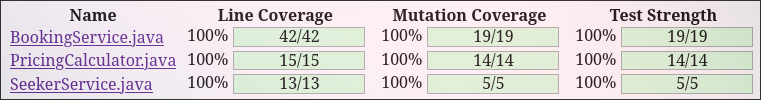

# Lab Reflection — WalkMates

**Lab:** 2  
**Pair:** Simon Kalitta (sika2400), Kiryl Yasny (kiya2400)
**Repo commit/tag:** [https://github.com/SimonKalitta/walkmates-test/commits/main/](https://github.com/SimonKalitta/walkmates-test/commits/main/), commit `4a783eb`.

---

### 1. What we did

We raised branch coverage to 100% for `PricingCalculator` by adding tests for shelter volunteer listings always should be free, overnight bookings should include a 20% surcharge, and bookings exactly 480 minutes shouldn't include the 20% surcharge (FR-4.3). The provided test already covered a non-overnight booking. 

Before:  


After:  


Mutation tests were also performed. We tested `BookingService` and `SeekerService` in isolation with _Mockito_ mocks for the repositories and services. We verified that the confirmation notification is sent, and tested `SeekerService::topUp` method. First time running PIT we could see `PricingCalculator` already have its mutants killed by the existing tests. We looked at the PIT report for both `BookingService` and `SeekerService` and methodically killed the mutations util none were left:  


### 2. What we found

When writing the test for bookings exactly 480 minutes, we notice that it failed and the expected result included the 20% surcharge when it shouldn't:
```
AssertionFailedError: 
    expected: 716.8
    but was: 860.16
```

The 600-minute overnight test triggered the surcharge line and together with the provided 60-minute test reached 100% branch coverage. Both tests produce the same result but only differ at exactly 480 minutes. Our boundary test at 480 minutes (from FR-4.3, "strictly greater than") failed against the provided code.

When looking in the `PricingCalculator::priceFor` `if`-statement, we can see that it checks the provided minutes to be greater or equal to the `OVERNIGHT_THRESHOLD_MINUTES`.

```java
if (booking.getDurationMinutes() >= OVERNIGHT_THRESHOLD_MINUTES)
```

This break the FR-4.3 requirement. It says that the overnight surcharge only applies when duration is greater than 480 minutes. Exactly 480 minutes does not trigger a surcharge. 

This means that the provided duration shouldn't be compared equal to the threshold, only greater than the threshold:

```java
if (booking.getDurationMinutes() > OVERNIGHT_THRESHOLD_MINUTES)
```

FR-4.4 rule 2 says a booking is accepted only if active bookings is less than the tier max. So it must be rejected at exactly the max. Inside `BookingService` we noticed that the boundary condition was wrong and checked only when active bookings is greater than the tier max instead of at the max or less:

```java
if (seekerActive > seeker.getMaxConcurrentBookings())
```

A new seeker with one active booking could book again, when it should be rejected:

```java
if (seekerActive >= seeker.getMaxConcurrentBookings())
```

#### Regression selection

With the new functionality it is crucial to ensure that we do not break existing code. The new feature introduces changes to the pricing policy which means it is important to verify that the pricing logic remains correct. Therefore, tests like `BookingServiceTest::checkSufficientSeekerBalance` and `BookingServiceTest::checkInsufficientSeekerBalance` are the most critical to run. Tests that check logic that is not affected by the change (e.g., throwing exceptions for unknown seekers, unknown listings, etc) are the lowest priority and do not need to be run every time., no

### 3. AI use (be honest — it doesn't lower your grade)

AI tools were barely used for this assignment as the previous knowledge and the instructions made it somewhat unnecessary. We are already familiar with Mockito from previous course, and there were no major problems or questions that would require help from AI. AI was used for two tests to help understand why our test didn't cover two mutations. A missing `when()` and a missing `assertThat()` was recommended by _Claude_ that we didn't notice.

### 4. Judgment

As mentioned above, almost no AI tools were used for this assignment so we made all decisions ourselves. 

### 5. What we'd test next

A new version of both tests must be implemented to account for weekend bookings as the existing test suite does not cover this scenario. Ideally, a few new tests should be added to cover different _edge cases_ and ensure the new logic works as intended.